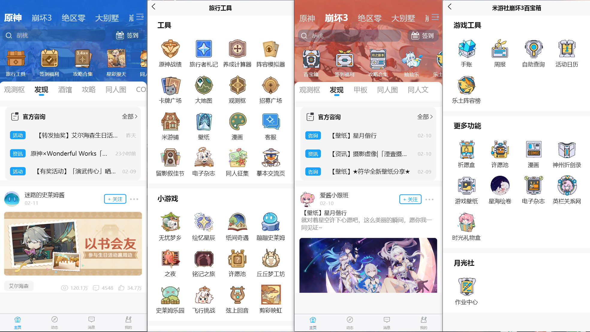
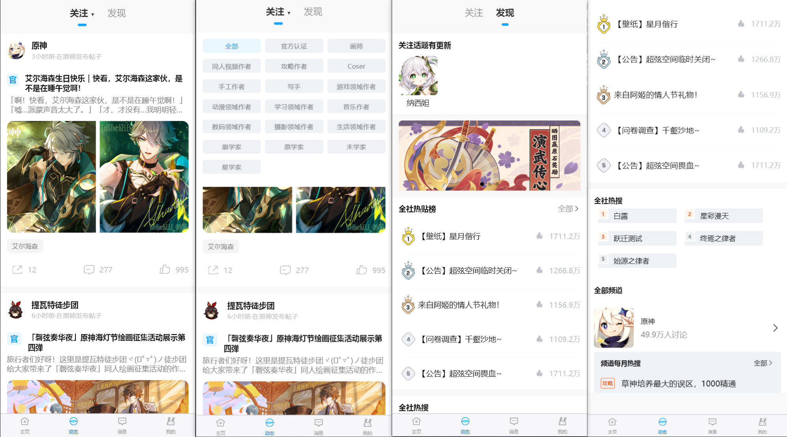
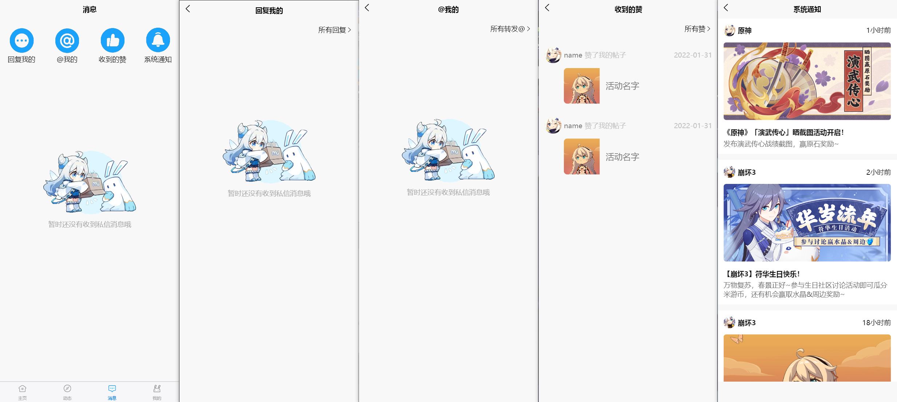
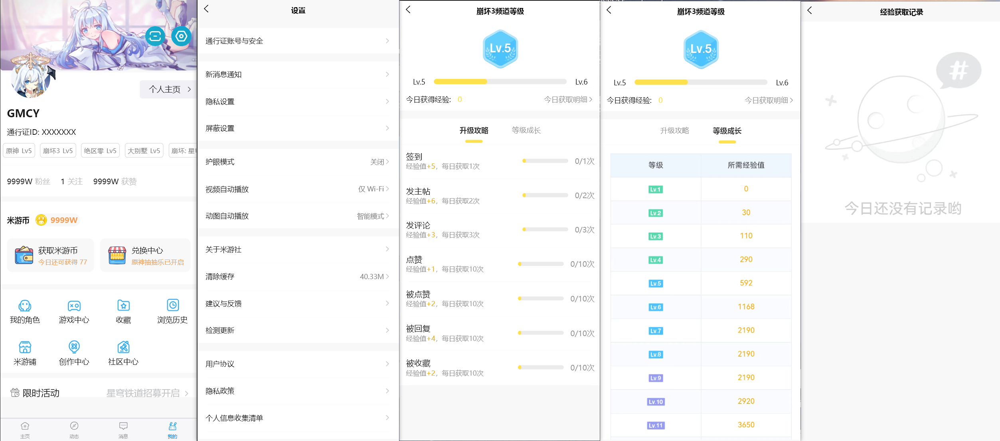
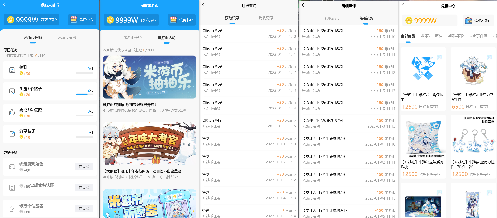
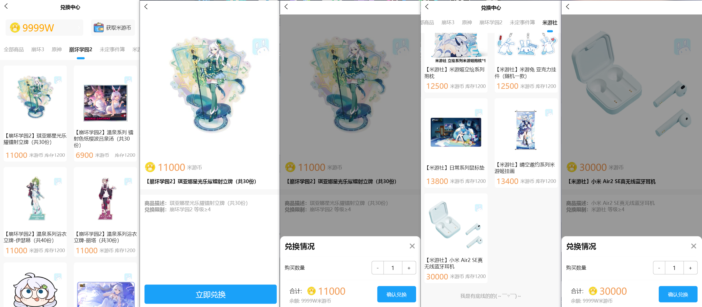

# 复刻米游社

## 1. 基本信息

- 作者: GMCY
- 系列: 复刻系列
- 仓库: [GitHub](https://github.com/GMCY2020/Reprint-MiYuShe) | [Gitee](https://gitee.com/GMCY2020/Reprint-MiYuShe)
- 话题(GitHub): [vue](https://github.com/topics/vue) \ [reprint](https://github.com/topics/reprint) \ [mihoyo](https://github.com/topics/mihoyo) \ [miyushe](https://github.com/topics/miyushe)
- 创建时间: 2023/01/31

## 2. 介绍

- 项目参考 [米游社](https://www.miyoushe.com/) , 进行粗略的模仿
- 项目 `Ui` 样式参考项目创建时 `米游社` 的样式
- 项目图片等资源来自 `米游社` , 仅编程学习用
- 项目只复刻了小部分功能, 都是静态的
- 项目运行后, 浏览器要 `切换为手机显示模式`
- 能力有限, 无法做到米家那般丝滑
- 项目应该还存在许多问题(ノへ￣、)
- 个人学习自用

## 3. 环境

编辑器
- `HBuilderX`

框架
- `vue`

## 4. 使用

解压后 `HBuilderX` 打开, 运行到浏览器即可

## 5. 效果图

主页

动态

消息

我的

